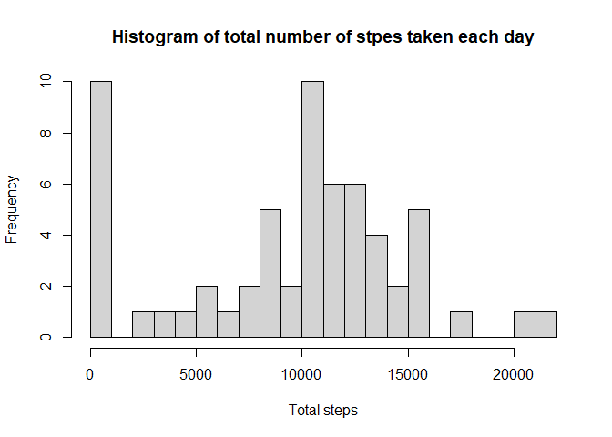
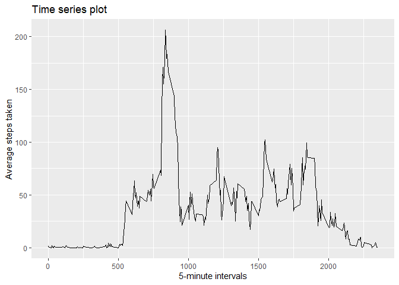
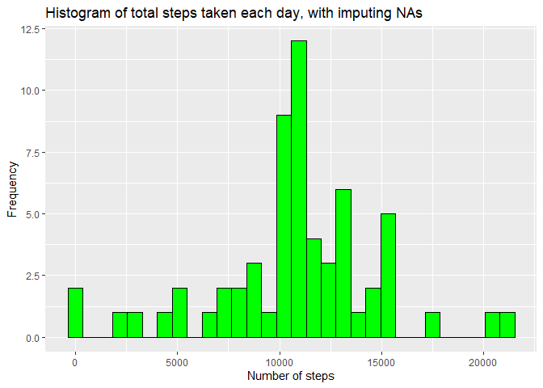
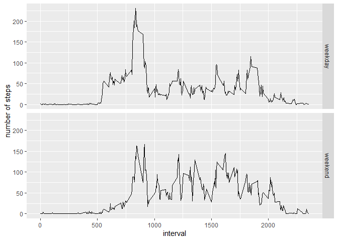

```r
knitr::opts_chunk$set(echo = TRUE)
```

## Loading and preprocessing the data
Reading data
  

```r
library("tidyverse")
```

```
## ── Attaching core tidyverse packages ──────────────────────── tidyverse 2.0.0 ──
## ✔ dplyr     1.1.2     ✔ readr     2.1.4
## ✔ forcats   1.0.0     ✔ stringr   1.5.0
## ✔ ggplot2   3.4.2     ✔ tibble    3.2.1
## ✔ lubridate 1.9.2     ✔ tidyr     1.3.0
## ✔ purrr     1.0.1     
## ── Conflicts ────────────────────────────────────────── tidyverse_conflicts() ──
## ✖ dplyr::filter() masks stats::filter()
## ✖ dplyr::lag()    masks stats::lag()
## ℹ Use the conflicted package (<http://conflicted.r-lib.org/>) to force all conflicts to become errors
```

```r
unzip("activity.zip")
activityData <- read.csv("activity.csv")
activityData <- as_tibble(activityData)
```

## What is mean total number of steps taken per day?
  
  Calculate the total number of steps taken per day
    

```r
totalMean <- activityData %>%
        group_by(date) %>%
        summarize(total = sum(steps, na.rm = TRUE))
```
  
  Make a histogram of the total number of steps taken each day
  

```r
hist(totalMean$total, breaks = 30, main = "Histogram of total number of stpes taken each day", xlab = "Total steps")
```

<!-- -->
    
  Calculate and report the mean and median of the total number of steps taken per day
    

```r
print(paste("Mean:", mean(totalMean$total, na.rm = TRUE)))
```

```
## [1] "Mean: 9354.22950819672"
```

```r
print(paste("Median:", median(totalMean$total, na.rm = TRUE)))
```

```
## [1] "Median: 10395"
```

## What is the average daily activity pattern?
  
Make a time series plot (i.e.  of the 5-minute interval (x-axis) and the average number of steps taken, averaged across all days (y-axis)  
  

```r
activityData %>%
        group_by(interval) %>%
        summarize(average = mean(steps, na.rm = TRUE)) %>%
        ggplot(aes(interval, average)) +
                geom_line() +
                labs(title = "Time series plot", x = "5-minute intervals", y = "Average steps taken")
```

<!-- -->
    
  Which 5-minute interval, on average across all the days in the dataset, contains the maximum number of steps?
    

```r
activityData %>%
        group_by(interval) %>%
        summarize(total = mean(steps, na.rm = TRUE)) %>%
        filter(total == max(total)) %>%
        rename(max_average = total)
```

```
## # A tibble: 1 × 2
##   interval max_average
##      <int>       <dbl>
## 1      835        206.
```
## Imputing missing values
  
  Calculate and report the total number of missing values in the dataset (i.e. the total number of rows with NAs)  
  

```r
print(paste("Total number of missing values:", sum(is.na(activityData$steps))))
```

```
## [1] "Total number of missing values: 2304"
```
  Devise a strategy for filling in all of the missing values in the dataset.

```r
newNa <- activityData %>% 
        group_by(interval) %>%
        summarize(mean=mean(steps, na.rm = TRUE)) %>%
        round()
```
  
  Create a new dataset that is equal to the original dataset but with the missing data filled in.
  

```r
NaImputed <- merge(activityData, newNa, by = "interval")
NaImputed[is.na(NaImputed$steps), 2] <- NaImputed[is.na(NaImputed$steps), 4]
NaImputed <- select(NaImputed, -mean)
NaImputed$date  <-ymd(NaImputed$date)
NaImputed <- NaImputed[with(NaImputed, order(date, interval)),]
```

Make a histogram of the total number of steps taken each day and Calculate and report the mean and median total number of steps taken per day. Do these values differ from the estimates from the first part of the assignment? What is the impact of imputing missing data on the estimates of the total daily number of steps?


```r
imputeSum <- NaImputed %>%
        group_by(date) %>%
        summarize(total = sum(steps))

ggplot(imputeSum, aes(total)) +
        geom_histogram(color = "black", fill = "green") +
        labs(title = "Histogram of total steps taken each day, with imputing NAs", x = "Number of steps", y = "Frequency")
```

```
## `stat_bin()` using `bins = 30`. Pick better value with `binwidth`.
```

<!-- -->

```r
print(paste("Mean without imputing:", mean(totalMean$total, na.rm = TRUE)))
```

```
## [1] "Mean without imputing: 9354.22950819672"
```

```r
print(paste("Median without imputing:", median(totalMean$total, na.rm = TRUE)))
```

```
## [1] "Median without imputing: 10395"
```

```r
print(paste("Mean with imputing:", mean(imputeSum$total)))
```

```
## [1] "Mean with imputing: 10765.6393442623"
```

```r
print(paste("Median with imputing:", median(imputeSum$total)))
```

```
## [1] "Median with imputing: 10762"
```
  
## Are there differences in activity patterns between weekdays and weekends?

Create a new factor variable in the dataset with two levels – “weekday” and “weekend” indicating whether a given date is a weekday or weekend day.
  

```r
wData <- mutate(NaImputed, weekpart = ifelse(wday(NaImputed$date, week_start = 1) %in% c(6,7), "weekend", "weekday"))
```

Make a panel plot containing a time series plot (i.e. type = "l") of the 5-minute interval (x-axis) and the average number of steps taken, averaged across all weekday days or weekend days (y-axis). See the README file in the GitHub repository to see an example of what this plot should look like using simulated data.
  

```r
wData  %>% 
        group_by(weekpart, interval) %>%
        summarize(average = mean(steps)) %>%
        ggplot(aes(interval, average)) +
                geom_line() +
                facet_grid(weekpart ~ .) +
                labs(x = "interval", y = "number of steps")
```

```
## `summarise()` has grouped output by 'weekpart'. You can override using the
## `.groups` argument.
```

<!-- -->


